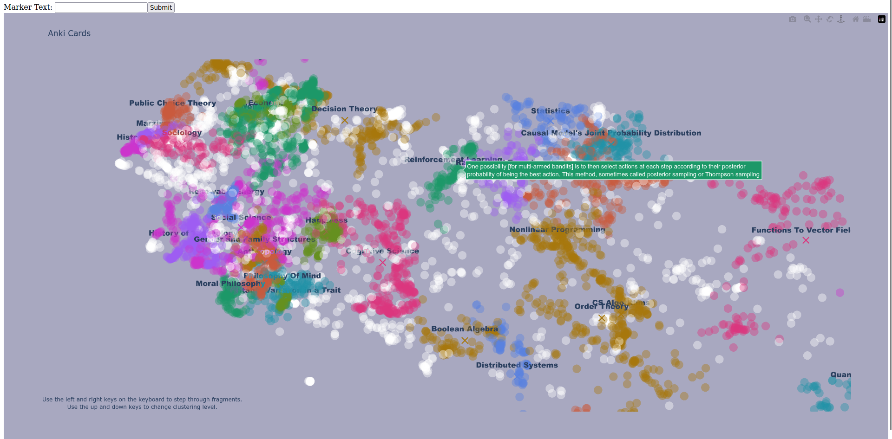

# Visualize and compare embeddings for text sequences

This is a small project for visualizing embeddings.

See the screenshot above or the interactive demo output [here](https://raw.githack.com/colehaus/hammock-public/main/demo.html).

The overall flow is:

1. One or more text sequences is split into sentences or paragraphs.
2. Each resulting text fragment is embedded using the requested embedding model.
3. The embeddings are reduced to two or three dimensions (as requested) via [UMAP](https://umap-learn.readthedocs.io/en/latest/index.html).
4. The low dimensionality embeddings are optionally clustered with [hdbscan](https://hdbscan.readthedocs.io/en/latest/index.html). A single set of embeddings can be clustered at multiple granularities.
5. Clusters are optionally summarized using the requested language model.

The resulting points and cluster info are plotted in an interactive 3D scatter plot.
- Plotly provides a number of default handlers for interaction.
- Left and right arrow keys step through text fragments in original text order (i.e. you could, in theory, read a book by stepping through its fragments and simultaneously see how the fragments relate to each other in embedding space).
- Up and down arrow keys step through clustering granularities. (i.e. you can see a very high-level "table" of contents and then "zoom in" to more and more granular "tables" of contents)

There's also some support and integration with a few existing text sources. A small web interface (`python -m hammock.gunicorn`) is provided for:

- Visualizing arbitrary text submitted in a textarea
- Fetching one or more books from Project Gutenberg by title and visualizing them
- Fetching one or more articles from Wikipedia by title and visualizing them

Modules can be accessed from the command line to:

- Batch process epubs from [Calibre](https://calibre-ebook.com/) (`python -m hammock.calibre.core`)
- Fetch cards from an [Anki](https://apps.ankiweb.net/) database and visualize them (`python -m hammock.anki -d <path-to-DB> -p <path-to-excluded-substrings-file>`)

If you have `nix`, you can simply do `nix run` from the project directory to set up the project launch the web server on localhost. `nix develop` will dump you into a shell with all the dependencies set up.
